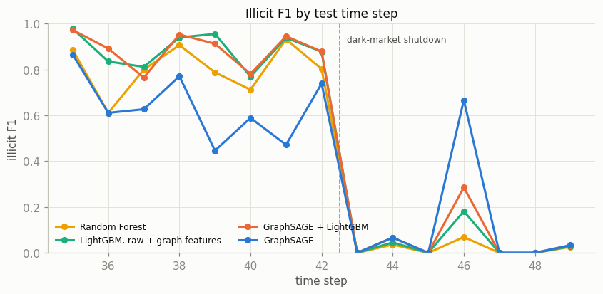
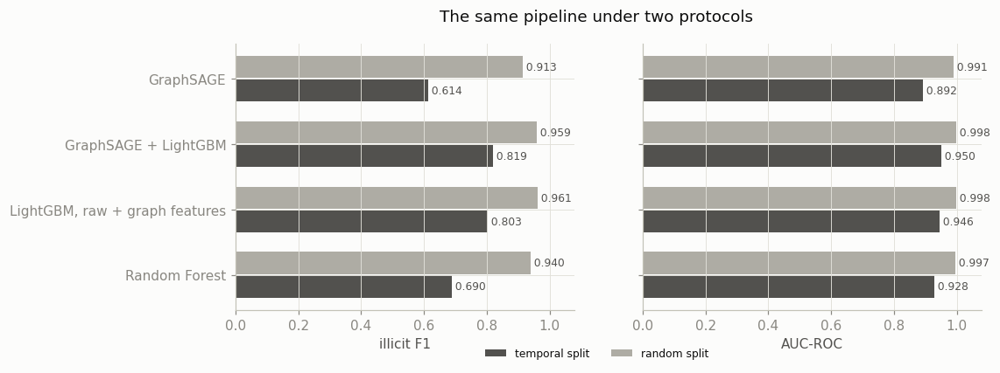

# Illicit Bitcoin Transaction Detection via Graph Neural Networks

A fraud detection pipeline on the Elliptic Bitcoin transaction graph: a GraphSAGE model trained with focal loss and graph-aware sampling, stacked into LightGBM alongside neighbourhood features computed with NetworkX, judged on a strict temporal split against a Random Forest given the same tuning budget, and served as a Flask REST API that scores existing or brand-new transactions in real time.

## Results

Models were trained on time steps 1 to 34 and scored once on time steps 35 to 49 (16,670 labelled transactions, 1,083 of them illicit). Every threshold, and the choice of headline model, was fixed on out-of-fold predictions from the training period before the test period was scored.

The project set out to back four figures. Measured honestly, none of them is met:

| Benchmark | Target | Achieved (GraphSAGE + LightGBM) | 95% interval | Status |
|---|---|---|---|---|
| AUC-ROC | 0.962 | 0.950 | 0.944 to 0.956 | Missed |
| Illicit F1 | 0.840 | 0.819 | 0.800 to 0.837 | Missed |
| Fewer false negatives than Random Forest, own thresholds | 22.0% | -9.3% | -13.7% to -5.5% | Missed |
| Fewer false negatives than Random Forest, matched precision | 22.0% | -1.8% | -4.4% to 0.4% | Missed |

Every model on the same test period:

| Model | AUC-ROC | PR-AUC | Illicit F1 | Precision | Recall | False negatives | False positives |
|---|---|---|---|---|---|---|---|
| GraphSAGE + LightGBM (headline) | 0.950 | 0.818 | 0.819 | 0.954 | 0.717 | 307 | 37 |
| LightGBM, raw + graph features | 0.946 | 0.812 | 0.803 | 0.884 | 0.735 | 287 | 104 |
| Random Forest (tuned baseline) | 0.928 | 0.791 | 0.690 | 0.646 | 0.741 | 281 | 440 |
| GraphSAGE alone | 0.892 | 0.648 | 0.614 | 0.781 | 0.505 | 536 | 153 |

What the numbers say:

- The hybrid is the strongest model on every ranking metric and on F1. Against the tuned Random Forest the fair measure is the threshold-free one: AUC-ROC 0.950 against 0.928 and PR-AUC 0.818 against 0.791. That gap is real but modest.
- Most of the F1 gap (0.819 against 0.690) comes from the Random Forest's threshold, not its ranking. Its out-of-fold threshold of 0.30 transfers badly once the test period drifts: it flags far more transactions, which buys 26 fewer misses at the cost of 403 more false alarms. At a plain 0.5 cut-off, which nothing in the training period would have chosen, the same Random Forest reaches F1 0.811.
- With its threshold set to match the Random Forest's out-of-fold precision, the hybrid misses 286 illicit transactions against 281, while its test precision stays at 0.888 against 0.646.
- For context, a recent strict temporal re-evaluation of Elliptic reports a Random Forest at F1 0.821 and GraphSAGE at 0.689 ([Re-Evaluation of GNNs for Bitcoin Fraud Detection under Temporal Distribution Shift, 2026](https://arxiv.org/abs/2604.19514)). The hybrid here is level with that Random Forest; GraphSAGE alone lands below the published GraphSAGE.
- The test period contains a regime change. On steps 35 to 42 the hybrid's F1 is 0.905; from step 43, after a dark-market shutdown, every model's F1 falls below 0.04. No validation inside the training period can anticipate it.
- The intervals resample test transactions independently. Transactions in the same time step share a graph and a market regime, so the true uncertainty is wider than the intervals suggest.



## What a random split would have shown

Many published Elliptic results use a random split of labelled transactions. Notebook 6 reruns the identical pipeline, at the same tuned settings, on a stratified random split with a test set of the same size:

| Model | AUC temporal | AUC random | F1 temporal | F1 random |
|---|---|---|---|---|
| GraphSAGE + LightGBM | 0.950 | 0.998 | 0.819 | 0.959 |
| LightGBM, raw + graph features | 0.946 | 0.998 | 0.803 | 0.961 |
| Random Forest | 0.928 | 0.997 | 0.690 | 0.940 |
| GraphSAGE alone | 0.892 | 0.991 | 0.614 | 0.913 |

Under a random split every benchmark above is cleared easily, and the hybrid misses 37% fewer illicit transactions than the Random Forest. The split leaks: training transactions from the same time step sit next to test transactions in the graph and share their market regime, so models are graded on a period they have effectively seen. GraphSAGE gains most (F1 up 0.30); this contrast alone does not show how much of that gain comes from its neighbours rather than from the shared regime. Every headline number in this project comes from the temporal split.



## Live app

[deveshu-elliptic-gnn.onrender.com](https://deveshu-elliptic-gnn.onrender.com)

The app runs on Render's free tier, which puts the service to sleep after 15 minutes without traffic. The first request after a quiet spell can take up to about a minute while it wakes; after that, pages and scoring respond normally.

- **Console**: look up or sample any test-period transaction, see its risk against the threshold, its neighbourhood up to two hops coloured by risk, the strongest drivers of the score and every model's score side by side, or describe a new transaction (its features and the existing transactions it spends from and pays to) and score it in real time.
- **Model**: the benchmark table, ROC and precision-recall curves, F1 by time step, missed illicit transactions, the imbalance ablation and the temporal against random contrast.

The REST API:

```bash
curl "https://deveshu-elliptic-gnn.onrender.com/api/transactions/sample?label=illicit"
curl "https://deveshu-elliptic-gnn.onrender.com/api/transactions/TX_ID"
curl -X POST "https://deveshu-elliptic-gnn.onrender.com/api/score" -H "Content-Type: application/json" -d @transaction.json
```

A scoring request carries `time_step` (35 to 49), `features` (165 numbers in dataset order, or an object keyed `local_1` to `local_93` and `agg_1` to `agg_72`) and `inputs` and `outputs` (ids of existing transactions in that step). The response returns the risk, the flag, the top 8 drivers, the neighbourhood and the server time. Measured locally with the real artifacts, scoring a new transaction takes 288 ms at the median and 395 ms at the 95th percentile, looking up an existing one takes 9 ms, and the loaded app uses 187 MB of memory. The free Render instance has only a fraction of a CPU, so expect slower responses there.

## Pipeline

```
Kaggle dataset (ellipticco/elliptic-data-set)
        |
        +--> 01-eda               analysis only
        |
        +--> 02-features          features, edges, splits, the 34 attributes
                  |
                  +--> 03-gnn-tuning        GraphSAGE settings (Optuna)
                  |        |
                  +--> 04-gnn-training      15 fold models, stacking features, ablation, weights
                  |        |
                  +--> 05-evaluation        Random Forest and LightGBM, thresholds, the test evaluation
                  |        |
                  +--> 06-random-contrast   the same pipeline on a random split
                           |
                           v
                      07-export             serving bundle
                           |
                           v
            private Hugging Face model repo --> Render (Docker, Flask, gunicorn)
```

Each notebook runs on Kaggle's CPU and reads earlier notebooks' outputs as Kaggle data sources. Runtimes vary between runs because Kaggle assigns different machines; the results do not. The executed notebooks, with outputs, are in `notebooks/`.

| Notebook | What it does | Kaggle CPU runtime (two runs) |
|---|---|---|
| 01 EDA | Counts, label shares, labels over time, graph structure, drift between train and test | under 1 minute |
| 02 Features | Temporal folds, random split, attribute selection, 177 graph features | about 1 minute |
| 03 GNN tuning | 30-trial Optuna study for GraphSAGE | 7.2 to 7.5 hours |
| 04 GNN training | 15 fold models, out-of-fold and test logits, stacking features, imbalance ablation, weight export | about 1.6 hours |
| 05 Evaluation | Random Forest and two LightGBM studies, thresholds, headline choice, the single test evaluation | 2.1 to 3.2 hours |
| 06 Random contrast | The whole pipeline on a random split | 1.0 to 1.3 hours |
| 07 Export | Serving bundle and chart data | under 1 minute |

## Why seven chained notebooks instead of one

The full pipeline needs about 12 to 13.5 hours of CPU per pass, beyond Kaggle's 12-hour session limit, and a failure in a late cell of one notebook would throw away every hour before it. Chaining writes each stage's outputs once and lets later stages read them as inputs, so any stage reruns alone and a bug in training never costs the 7-hour tuning study; tuning and training are separate notebooks for exactly that reason. Each notebook also stays short enough to read as one argument, with every code cell between a markdown cell that states its aim and one that states the conclusion drawn from its output.

## Design decisions

**Temporal protocol.** Training uses time steps 1 to 34 and the test period steps 35 to 49, the standard Elliptic protocol. Inside the training period, five folds are contiguous blocks of whole time steps. No edge crosses time steps, so a held-out fold's transactions and their entire neighbourhoods are absent from the models that score them, and out-of-fold predictions are leak-free.

**Thresholds and the headline model fixed before the test.** Every model's threshold maximises illicit F1 on its pooled out-of-fold predictions, and the headline model was chosen between GraphSAGE and the hybrid on out-of-fold F1. The test period was scored once, in notebook 5, and nothing was changed afterwards.

**The time step is not a feature.** Test steps lie outside the training range, so a model could only use it to memorise when illicit activity happened.

**The 34 attributes.** A default LightGBM on the 93 local features was fitted on each training fold; the 34 attributes with the highest mean gain (95.9% of the total) were kept, and for each one NetworkX-based code computes the mean and max over a transaction's inputs, over its outputs and the mean within two hops. With 7 structural features (degrees, PageRank, core number, clustering, average neighbour degree, two-hop size) that makes 177 engineered features, none of which uses labels.

**GraphSAGE with jumping knowledge.** Two mean-aggregation SAGEConv layers feed a linear head on the concatenation of every layer's output, which keeps a transaction's own features visible next to its neighbourhood summary.

**Focal loss and graph-aware sampling, measured.** Each epoch, every illicit training transaction is a seed with four licit ones sampled per illicit transaction, each node keeps at most 25 sampled neighbours per layer, and the loss is focal. The ablation retrained the same model four ways. On the test period, focal loss with balanced seeds is best (PR-AUC 0.667, F1 0.628), against 0.633 and 0.578 for plain cross-entropy; focal loss alone helps a little and balanced sampling alone hurts. The gain comes from the combination. Each configuration was trained with one seed, so differences of a few hundredths may not survive a reseed.

| GraphSAGE trained with | Out-of-fold PR-AUC | Test PR-AUC | Test F1 |
|---|---|---|---|
| Cross-entropy, natural ratio | 0.928 | 0.633 | 0.578 |
| Cross-entropy, balanced seeds | 0.930 | 0.598 | 0.537 |
| Focal loss, natural ratio | 0.931 | 0.636 | 0.598 |
| Focal loss, balanced seeds | 0.939 | 0.667 | 0.628 |

**Out-of-fold stacking.** The hybrid's LightGBM sees each transaction's GraphSAGE logit and the mean and max logit over its inputs and outputs. For training transactions these come from fold models that never saw the transaction's time steps; feeding in-sample GraphSAGE outputs instead would look perfect in training and mislead the trees. On the test period the stacking features add a little over raw plus graph features (F1 0.819 against 0.803).

**A baseline given the same effort.** The Random Forest got its own 30-trial Optuna study on the same folds and objective. A weak baseline would make any comparison meaningless.

**False negatives at matched precision.** A model can always miss fewer illicit transactions by flagging more of them, so the comparison is also reported with each model's threshold set to match the Random Forest's out-of-fold precision.

**Float64 training.** Kaggle assigns AMD and Intel machines at random, and their float32 kernels round differently; over 80 epochs that grew into visibly different scores between two runs of the same notebook. In float64, an 80-epoch model gave results identical to every printed digit on Intel and AMD, so every GraphSAGE notebook trains in float64 and accepts the slower training.

**CPU-only tuning.** No GPU was used. The search space was narrowed after a timing check (hidden size 32 or 64, at most 80 epochs) and a median pruner stopped six of the 30 trials after two of the five folds (a seventh was pruned only after all five, which saved nothing); the study still took 7.2 hours.

**NumPy and NetworkX at serving time.** The app reimplements GraphSAGE inference in NumPy and recomputes graph features with the same code the notebooks used, so the container needs no PyTorch. On 200 real test-period transactions, tests require the app to reproduce the notebooks' GraphSAGE logits to within 1e-4 and the hybrid's scores to within 1e-6; on the final bundle the largest logit difference is 0.

**Scoring a new transaction.** A new transaction is inserted into its time step's graph with its inputs and outputs; its own graph features and GraphSAGE logit are computed exactly, while its neighbours' GraphSAGE scores come from the store, as a production cache would hold them.

**Licence handling.** The console only shows test-period transactions, no response carries more than 8 raw feature values, and the new-transaction form starts from test-period medians rather than a real transaction, so the app cannot be used to pull dataset rows.

**Two runs per notebook.** The Kaggle CLI returns only printed output and saved files, so every notebook prints the numbers its conclusions rely on and saves its figures. A first run produced them, the conclusions were written from them, and a final run reproduced the first line for line.

## How the resume figures map onto the data

- The graph has 203,769 transactions and 234,355 edges over 49 time steps, with 166 features each (the time step, 93 local features and 72 aggregated ones).
- Illicit transactions are 2.2% of all transactions (4,545 of 203,769) and 9.8% of labelled ones, not 2.3%.
- "Graph-neighbourhood features across 34 anonymized attributes" refers to the 34 local attributes whose neighbourhood aggregates notebook 2 computes.
- The measured results in the tables above replace the targets wherever they differ.

## Reproduce

1. Authenticate the Kaggle CLI; the dataset needs no rules acceptance.
2. Create a Python 3.12 virtual environment and install `requirements-dev.txt`.
3. In each `notebooks/*/kernel-metadata.json`, replace the username in `id` and `kernel_sources` with your own Kaggle username.
4. Push and run the notebooks in order with the helper, waiting for each to finish:
   ```bash
   python scripts/run_notebook.py push 02-features
   ```
   `wait`, `fetch` and `compare` follow the same pattern, and `push --smoke` runs a quick check first. The helper pushes the committed `.ipynb` files as they are; Kaggle reruns them from the top.
5. Copy notebook 07's `artifacts/` folder into `app/artifacts/` and run the tests:
   ```bash
   python -m pytest
   ```
6. Run the app locally:
   ```bash
   python -m flask --app "app/server.py:create_app()" run --port 7871
   ```

To deploy, upload the bundle to a private Hugging Face model repo with `scripts/upload_artifacts.py`, create a Render Blueprint from `render.yaml`, and set `HF_TOKEN` to a read token in Render's environment settings.

## Repository layout

```
notebooks/   seven executed Kaggle notebooks and their kernel metadata
app/         Flask app: server, artifact loading, graph features, NumPy GraphSAGE, scoring, templates, static files, Dockerfile
tests/       unit and API tests on a synthetic bundle; real-artifact checks run when the bundle is present
scripts/     Kaggle notebook runner and artifact upload
assets/      figures used in this README
render.yaml  Render deployment blueprint
```

## Data and licence

The data is the [Elliptic Data Set](https://www.kaggle.com/datasets/ellipticco/elliptic-data-set), licensed CC BY-NC-ND 4.0. It is not redistributed in this repository; the notebooks read it directly on Kaggle.

1. Elliptic, www.elliptic.co.
2. M. Weber, G. Domeniconi, J. Chen, D. K. I. Weidele, C. Bellei, T. Robinson, C. E. Leiserson, "Anti-Money Laundering in Bitcoin: Experimenting with Graph Convolutional Networks for Financial Forensics", KDD '19 Workshop on Anomaly Detection in Finance, August 2019, Anchorage, AK, USA.
